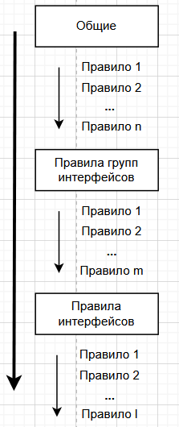
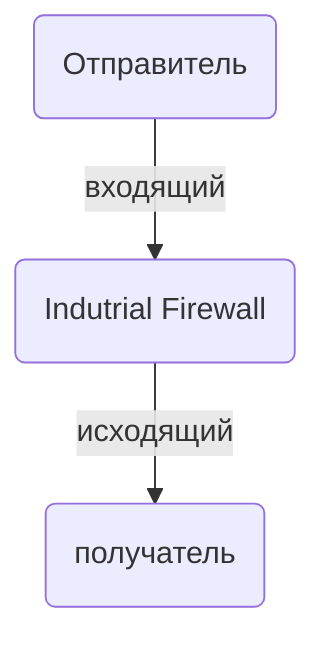

## Правила ##
Правила межсетевого экранирования определяют, как Idustrial Firewall будет управлять проходящим через него трафиком.

Группа страниц графического интерфейса "Межсетевой экран - Правила" предоставляет инструменты для управления всеми правилами межсетевого экранирования Industrial Firewall. 

Все правила межсетевого экранирования сгруппированы в несколько списков правил.

Списки правил сгруппированы по области действия: 
* правила, действующие на отдельные сетевые интерфейсы; 
* правила, действующие на группы сетевых интерфейсов; 
* правила, действующие на все интерфейсы и сетевые группы (опционально).

Каждому списку правил посвящена отдельная страница графического интерфейса "Межсетевой экран - Правила". 

### Логика работы ###
Каждое правило межсетевого экранирования содержит набор критериев для сетевого пакета и действие, которое должно быть применено к сетевому пакету. 
Industrial Firewall для каждого сетевого пакета проверяет все активные правила межсетевого экранирования, выбирает из всех активных правил одно правило (правило-победитель) и выполняет над сетевым пакетом действие, указанное в правиле-победителе.

С целью удобства конфигурирования все правила межсетевого экранирования в интерфейсе Industrial Firewall организованы в списки правил.

Списки правил отличаются приоритетом (сперва будет выполнена проверка правил, находящихся в списке с более высоким приоритетом) и областью действия списка. 

Последовательность расположения правил в списках так же имеет значение, так как Industrial Firewall проверяет все правила в списке и проверку выполняет строго в направлении от первого правила к последнему. В общем случае из нескольких подходящих правил победителем будет выбрано то, которое расположено ближе конкурентов к концу списка, его действие будет выполнено над пакетом (побеждает последний подходящий).  

Указанный общий случай выбора правила-победителя на практике часто модифицирован доступными настройками Industrial Firewall, влияющими на порядок выбора правила-победителя, такими настройками являются: опция "Быстрая проверка", механизм отслеживания состояния соединений, группировка интерфейсов. Влияние различных настроек на порядок выбора правила-победителя подробно описано в разделе [Порядок выполнения](#порядок-выполнения).

#### Порядок выполнения ####
Как было указано в разеделе руководства [Логика работы](#логика-работы) внутри каждого списка правила проверяются в последовательности от начала списка к концу списка, при этом в Industrial Firewall всегда существует несколько списков правил (как минимум списки "Общие", "WAN", "LAN"), выбор списка для проверки его правил осуществляется в последовательности, изображенной на рисунке n.2.

 

Рисунок n.2. Порядок проверки списков правил межсетевого экранирования

Первыми проверяются правила из списка Общие, затем проверяются правила из списков соответствующих групп интерфейсов, затем правила из списков интерфейсов.

Весь набор правил (из каждого списка), на соответствие которым проверяется пакет, может быть быть представлен как один большой результирующий список, структура и порядок обхода которого изображены на русунке n.3.

 

Рисунок n.3. Pезультирующий список

Исключение из правила "**побеждает последний выигравший**".

Полная проверка всех правил результирующего списка может быть остановлена на текущем правиле, если сетевой пакет соответствует критериям правила, и в правиле активна опция "Быстрая проверка". 

Опция "Быстрая проверка" означает, что правило проверка подошедшедшего под критерии правила пакета будет остановлена, и над пакетом будет выполнено действие, указанное в правиле.

#### Действие ####
Каждое правило содержит одно из трех возможных действий, которое должно быть применено к сетевому пакету. Описание действий приведено в таболице n.2. 

Таблица n.2
<table>
    <tr>
        <th>Действие</th><th>Описание</th>
    </tr>
    <tr>
        <td>Разрешить (Pass)</td><td>Разрешить движение пакета</td>
    </tr>
    <tr>
        <td>Блокирование</td><td>Отбросить пакет и не отсылать отправителю пакета уведомление о действии над пакетом</td>
    </tr>
    <tr>
        <td>Отклонить (Reject)</td><td>Отбросить пакет и отправить отправителю пакета сообщение о действии над пакетом (уведомление может быть отправлено только для протоколов TCP и UDP,  для протокола TCP будет отправлен пакет с установленным флагом RST, для протокола UDP будет отослано ICMP-сообщение UNREACHABLE</td>
    </tr>
</table>

#### Направление ####
Пакеты могут быть оценены правилами межсетевого экранирования по параметру направления как входящие или исходящие (рисунок n.4).

Рисунок n.4. 4 Входящие и исходящие правила

По умолчанию во всех создаваемых правилах опция "Направление" содержит значение "Вх." (входящий). Ограничение трафика лучше выполнять на том порте, на который этот трафик может уйти, а не на том, из-под которого он может выйти.

Использвание правил межсетевого экранирования для исходящего трафика как правило используется редко и для специфических целей.

К примеру, если необходимо разрешить весь HTTPS-трафик из интернета к хостам внутренней сети, то следует разрешать трафик по порту 443(стандартный порт для HTTPS) на интерфейсе WAN.

#### Состояние ####
Industrial Firewall является межсетевым экраном с поддержкой отслеживания состояний соединений (stateful firewall), *запоминает на некоторое время информацию о маршрутах разрешенных правилами пакетов и переносит "доверие" к пакету, следующему по маршруту, на сам маршрут, после чего все пакеты, следущие по этому маршруту "наследуют" доверие уже от маршрута (в обестороны) и пропускаются межсетевым экраном в обход проверки всех правил. *
 
Механизм отслеживания состояний значительно ускоряет выбор действия над пакетом, так как не выполняет проверку пакета через весь список правил межсетевого экранирования, а сперва сравнивает пакет со списком активных сетевых соединений, если пакет принадлежит активному сетевому соединению, то он разрешается (действие "Разрешить (Pass)"), если пакет не принадлежит ни одному активному сетевому соединению, то для него выполняется проверка по всему списку активных правил. 

Поиск активного сетевого соединения для пакета выполняется гораздо быстрее чем перебор активных правил межсетевого экранирования, так как активное сетевое соединение в общем случае идентифицируется всего двумя параметрами: IP-адрес отправителя и IP-адрес получателя.

В логике работы INdustrial Firewall сетевое соединениние -- это запись в таблице соединений (внутренняя таблица Industrial Firewall), содержащая IP-адреса отправителя и получателя, номра портов отправителя и получателя и время жизни соединения.

Сетевое соединение (как запись в таблице) создается автоматически в следующих условиях (последовательных событиях):

1. в межсетевой экран пришёл пакет;
2. для указанного пакета на текущий момент нет активного соединения;
3. пакет проходит проверку по списку правил межсетевого экранирования;
4. пакет попадает под правило с разрешающим действием (Разрешить (Pass)). 

Для каждого сетевого соединения устанавливается время жизни. Если по истечении времени жизни больше ни один пакет не попадет под действие этого соединения, то запись о соединении будет удалена. Если пакет, попадающий под соедниение, пройдет через межсетевой экран до истечения срока жизни соединения, то информация о сроке жезни соединения будет обновлена.

Так же к удобствам механизма отсележивания состояний соединений относится то, что прошедший в одном направлении пакет инициирует создание соединения, по которому идущие в обратном направлении пакеты будут пропущенны межсетевым экраном, даже если для них не заданы явные разрешающие правила. К примеру, если TCP-соединение отслеживается межсетевыми экраном, то относящиеся к этому соединения служебные ICMP-сообщения будут пропущенны. межсетевым экраном.

По умолчанию каждое разрешающее правило порождает создание записи о соединении, изменить это поведение возможно, указав в опции "Тип состояния" соответствующего правила заначение "NONE".

Для каждого правила межсетевого экранирования можно ограничить количество соединений и указать действие над пакетом, если к подпадающему под правило пакету не может быть выделено соединение (по умолчанию такой пакет будет отклонен(reject) ).

Для протокола TCP идентиифкация соединения происходит не только по адресу отправителя и получателя, но и по характеристикам TCP-сессии.

Просмотреть сведения об активных сетевых соединениях можно в разделах графического интерефейса "Межсетевой экран - Диагностика - Снимок состояний" и "Межсетевой экран - Диагностика - Сводка состояний".

 
 
> **Примечание**
> 
> Иногда необходимо сбросить все существущие состояния (к примеру, при смене правил межсетевого экранирования).
> Выполнить сброс все существующих состояний можно в графическом интерфейсе "Межсетевой экран - Диагностика - Сброс состояний".

 

> **Примечание**
> 
> Таблица состояний соединений хранится в оперативной памяти. 
> Каждая запись о соединении занимает около 1 кб оперативной памяти.
> По умолчанию Industrial Firewall резервирует 10 % доступной оперативной памяти под таблицу состояний соединений. 
> Изменить размер таблицы состояний соединений можно в раздедле "Межсетевой экран - Настройки - Дополнительно", параметр "Максимальное количество состояний межсетевого экрана".
> В тексте описания данного параметра указан размер таблицы по умолчанию.
 

Подробнее о использовании настроек и опций правил межсетевого экранирования, связанных с поведением отслеживания состояний соединений приведено ниже в соответствующих разделах.

#### Опции правил ####

Таблица n.3. Описание опций правил межсетевого экранирования
<table>
    <tr>
        <th>Название опции</th><th>Описание</th>
    </tr>
    <tr>
        <td>Действие</td><td>Действие над пакетом ( подробнее в разделе [Действие](#действие) )</td>
    </tr>
    <tr>
        <td>Отключена</td><td>Отключение правила без удаления, может быть полезно в целях тестирования или быстроее включение нечастно используемых правил</td>
    </tr>
    <tr>
        <td>Быстрая проверка</td><td>Текущее правило применится к подошедшему пакету, полный перебор всех правил не будет выполнен (подробнее в разделе [Порядок выполнения](#порядок-выполнения)) </td>
    </tr>
    <tr>
        <td>Интерфейс</td><td>Интерфейс, для которого применяется правило</td>
    </tr>
    <tr>
        <td>Направление</td><td>Для входящих или исходящих пакетов применяется правило (подробнее в разделе [Направление](#направление) )</td>
    </tr>
    <tr>
        <td>Версии TCP/IP</td><td>Применяется это правило для IPv4 или IPv6 или для обоих</td>
    </tr>
    <tr>
        <td>Протокол</td><td>Протокол, вложенный в IP-пакет (`механизм отслеживания состояния соединений прменяется только для протоколов TCP, UDP, ICMP`)</td>
    </tr>
    <tr>
        <td>Отправитель/Инвертировать</td><td>Инвертировать выбранного отправителя (к примеру отправителем будет не адрес 192.168.1.1)</td>
    </tr>
    <tr>
        <td>Отправитель</td><td>Адрес хоста или сети, допускается использование псевдонимов</td>
    </tr
    <tr>
        <td>Получатель/Инвертировать</td><td>Инвертировать выбранного получателя</td>
    </tr>
    <tr>
        <td>Получатель</td><td>Адрес хоста или сети, допускается использование псевдонимов</td>
    </tr
    <tr>
        <td>Диапазон портов назначения</td><td>Для протоколов TCP или UDP диапазон портов, псевдонимы портов или зарезервированное слово из выпадающего списка</td>
    </tr>
    <tr>
        <td>Журналирование</td><td>Создавать запись в журнале, когда это правило применяется. Просмотреть журнады можно в разделе графического интерфейса "Межсетевой экран - Журналы"</td>
    </tr 
    <tr>
        <td>Категория</td><td>Категория, которой принадлежит правило, служит для визуальной группировки правил. Не влияет на поведение правила</td>
    </tr>
    <tr>
        <td>Описание</td><td>Описание првила. Не влияет на поведение правила</td>
    </tr>
    <tr>
        <td>ОС источника</td><td>Наименование операционной системы из списка поддерживаемых. Определение операционной системы отправителя пакета основано на анализе атрибутов протокола TCP и не является точным. Поддерживается только для протокола TCP</td>
    </tr>
    <tr>
        <td>Не синхронизировать через XMLRPC</td><td>Данная опция имеет значение, если Industrial Firewall функционирует в составе кластера. На ведущем устройстве кластера предотвращает синхронизацию правила с другим участниками кластера, но не предотвращает перезапись правила на ведомом устройстве</td>
    </tr>
    <tr>
        <td>Расписание</td><td>Для правил можно установить период активности. Объекты расписания можно добавть через раздел графического интерфейса "Межсетевой экран - Настройки - Расписания", после этого они будут отображаться в выпадающем списке опции</td>
    </tr>
    <tr>
        <td>Шлюз</td> <td>Если выбрано значение "по умолчанию", то используются стандартные системные маршруты. Так же можно указать специальные шлюзы (управление данными о шлюзах осуществляется через графический интерфейс "Система - Шлюзы")     
        </td>
    </tr>
    <tr>
        <td>Разрешить параметры</td> <td>Разрешает пакеты протокла IP, у которых задействован раздел заголовка IP-пакета "Опции". По умолчанию  они блокируются</td>
    </tr>
    <tr>
        <td>Отключается ответ к</td> <td>По умочанию весь трафик, исходящий от интерфейса, к которому подключен шлюз, будет "принудительно" отправляться к щлюзу. Опция отключает это поведение</td>
    </tr>
    <tr>
        <td>Установить приоритет</td> <td>Для пакетов, соответствующих критериям этого правила, будет назначен приоритет. Если пакет будет передан через интерфейс с активным VLAN, приоритет будет записан в заголовок кадра 802.1Q VLAN. Если оба приоритета устанавливаются здесь, пакетам с TOS "lowdelay" или TCP ACKs без данных нагрузки будет назначен последний
    </tr>
    <tr>
        <td>Установить локальный тег</td> <td>Для пакетов, соответствующих критериям этого правила, будет добавлен внутренний тэг. Тэг используется только внутри Industrial Firewall, в том числе в других правилах межсетевого экранирования как критерий пакета. Тэг будет добавлен к пакету даже, если правило не является правилом-победителем. Дальнейшие правила могут заменить тег, присвоив свой тег, но не удалят добавленный тег. Пакету назначается только один тег за одно правило </td>
    </tr>
    <tr>
        <td>Проверка на соответствие локального тега</td> <td>Проверить наличие тега (тег устанавливается в соответствии с опцией "Установить локальный тег")</td>
    </tr>
    <tr>
        <td>Макс. состояний</td> <td>Максимальное количество записей о состоянии соединений, которые может создавать правило. Если максимальное количество записей достигнуто, то критериям этого правила не будут соответствовать никакие пакеты, пока количество записей о состояниях, созданных этим правилом, не уменьшится</td>
    </tr>
    <tr>
        <td>Макс. узлов-источников</td> <td>Максимальное количество адресов отправителей, которые могут одновременно иметь записи в таблице состояний соединений</td>
    </tr>
    <tr>
        <td>Макс. установленных соединений</td> <td>Максимальное количество записей о состоянии соединений по протоколу TCP, которые завершили трехсторонее рукопожатие</td>
    </tr>
    <tr>
        <td>Макс. состояний-источников</td> <td>Максимальное количество записей о состоянии соединений, которые может иметь одинин отправитель</td>
    </tr>
    <tr>
        <td>Макс. новых соединений</td> <td>Максимальное количество записей о состоянии соединений, создаваемых этим правилом в единицу времени(в секундах) (только для протокола TCP)</td>
    </tr>
    <tr>
        <td>Тайм-аут состояния</td> <td>Длительность состояния Тайм-аут для соединения по протокоу TCP</td>
    </tr>
    <tr>
        <td>Флажки TCP</td> <td>Отдельные флаги протокола TCP</td>
    </tr>
    <tr>
        <td>Тип состояния / НЕТ pfsync</td> <td>Предотвращает передачу информации о записиях о состоянии соединений другим участникам кластера межсетевых экранов</td>
    </tr>
    <tr>
        <td>Тип состояния</td> <td>Выбор механизма отслеживания состояний соединений (по умолчанию используется "KEEP STATE").
        KEEP STATE - полное отслеживание состояний сетевых соединений.
        SLOPPY STATE - работает как keep state, но не проверяет порядковые номера в заголовках TCP-сегмента. Используйте этот режим, если Industrial Firewall видит не все пакеты.
        MODULATE STATE - генерировать надежный параметр Sequence Number для TCP-соединений
        SYNPROXY STATE - проксирует входящие соединения TCP для защиты серверов от Spoofed TCP и SYN-flood атак. Эта настройка включает в себя комбинацию функций KEEP STATE и MODULATE.
        NONE - не использовать механизмы отслеживания состояний
        </td>
    </tr>

</table>
